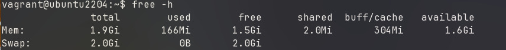
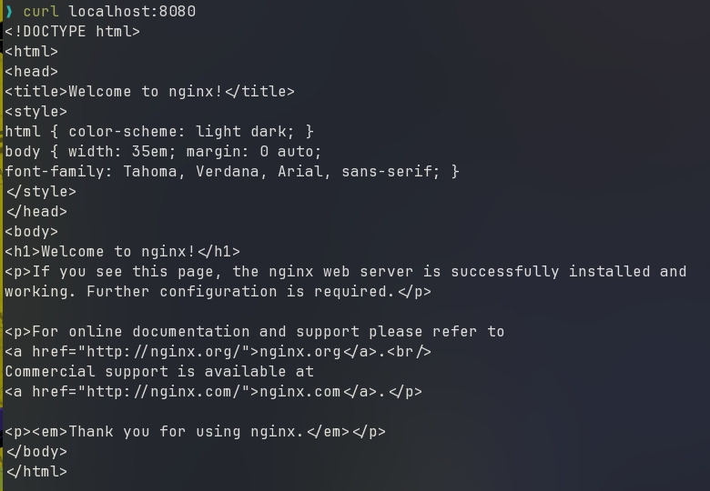
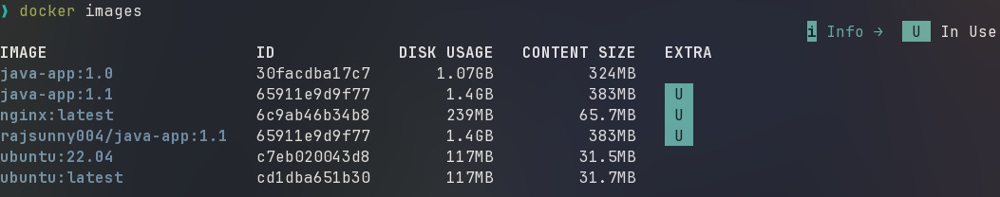

## **Experiment - 1**: Comparison of Virtual Machines (VMs) and Containers using Ubuntu and Nginx

### **Objective**
1. To understand the conceptual and practical differences between Virtual Machines and Containers.

2. To install and configure a Virtual Machine using VirtualBox and Vagrant on Windows.

3. To install and configure Containers using Docker inside WSL.

4. To deploy an Ubuntu-based Nginx web server in both environments.

5. To compare resource utilization, performance, and operational characteristics of VMs and Containers.


### **Part A: Virtual Machine**

2 days ago

Add Experiment 2
 - Download Vagrantfile of required VM OS using `vagrant init generic/ubuntu2204`, run `vagrant up --provider=libvirt` to start up the VM and `vagrant ssh` to access the VM terminal.
5 days ago

Restructure labfile and Add theory files


 - Install nginx using `sudo apt install -y nginx` and run the service using `sudo systemctl start nginx`. Verify it by `curl localhost`.


#### **Observations**
**1. Storage Utilization:** The disk usage for the VM.
```PS
sudo virsh domblkinfo Experiment1_default vda --human
```

  
> The VM installation consumed approximately **702.879 MB** of disk space to store the Guest OS and virtual disk.

**2. Boot Performance:** The startup time required for the Virtual Machine to boot.
```bash
systemd-analyze
```

> The VM took **8.019 seconds** to fully boot (Kernel: 2.339s + Userspace: 5.679s), demonstrating high startup latency.

**3. Memory Usage:** Amount of RAM resources allocated to and used by the Guest OS.

```bash
free -h
```


> The VM reserved **1.9Gb** of total RAM from the host, with *166 MB* actively used and 304 MB used up in buffers/cache.

### **Part B: Containers**

 - Run the `docker run -d -p 8080:80 --name nginx-container nginx` command to create and run the container. Verify that the nginx container is running wih `curl localhost:8080`.

    - `-d`: Runs the container in the background, allowing you to continue using the terminal session.
    - `-p 8080:80`: Maps port 8080 for the host to port 80 for the container.




#### **Observations**
**1. Storage Utilization**
An analysis of the disk space required for the container images.

```bash
docker images
```



> The Nginx container image requires only **65.7MB**.

**2. Boot Performance**
Measurement of the time required to start the containerized application.

```bash
time docker run -d -p 8080:80 --name nginx-container nginx
```


> The container started in **0.411 seconds**.

**3. Memory Allocation**
Real-time monitoring of the container's resource consumption.

```bash
docker stats
```


> The running container uses **13.11 MiB** of RAM.


