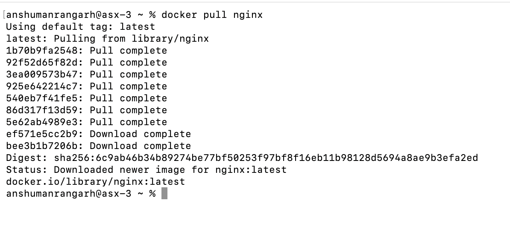
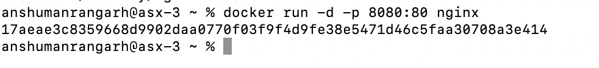
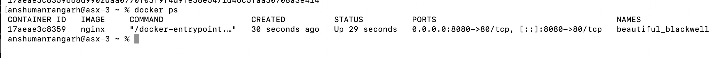
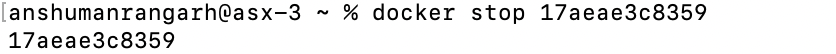
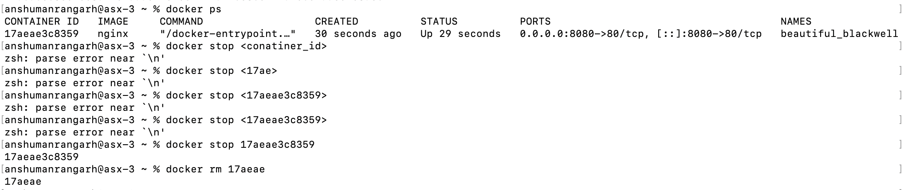
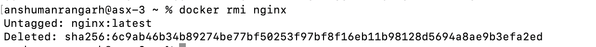

## **Experiment 2:** Docker Installation, Configuration and Image Management

### **Objective:**
1. Pull docker images
2. Run Conatianers
3. Manage container lifecycle

### **Procedure**
1. Pull Image
```Bash
docker pull nginx
```


2. Running the container with port mapping.
```Bash
docker run -d -p 8080:80 nginx
```

 - -d (detached): Runs the container in the background
 - -p 8080:80 (publish): Connects a port on host to a port inside the container.
    - 8080 : Host's Port
    - 80 : Container's port
 - The output is the ID of the container.

3. Verifying the running container.
```Bash
docker ps
```


4. Stop the running container, then remove it.
```Bash
docker stop <conatiner_id>
```

```Bash
docker rm <container_id>
```


5. Remove image
```Bash
docker rmi <image_name>
```


### **Result**
Docker images were successfully pulled, containers executed, and lifecycle commands performed.
