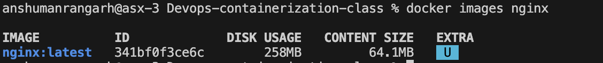
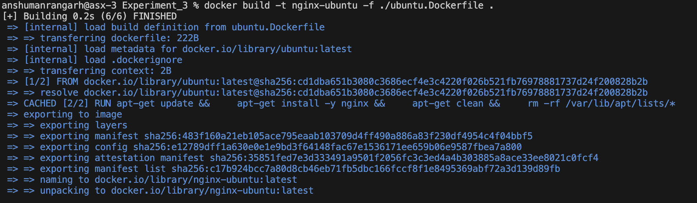
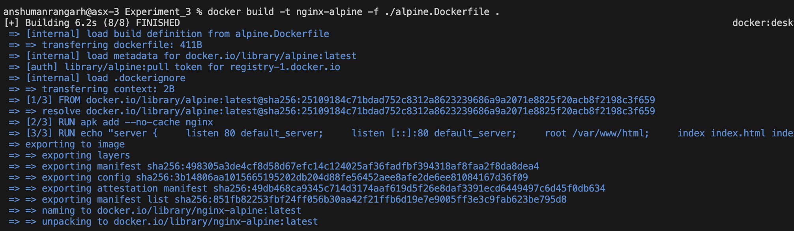
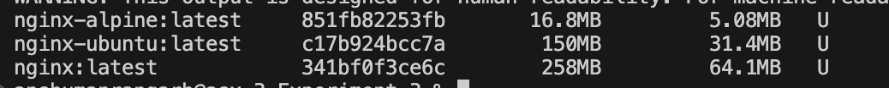
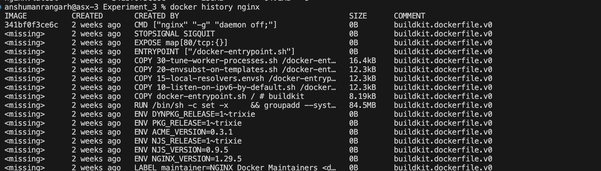
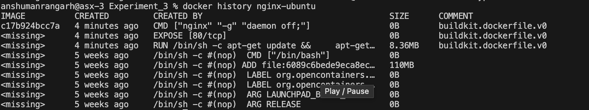
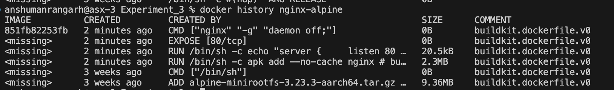
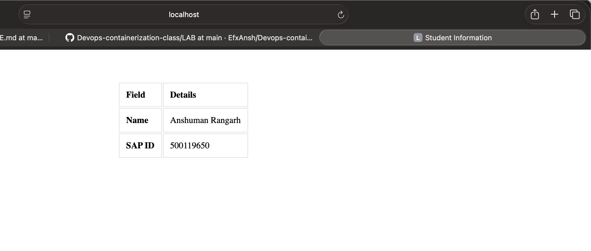

## **Experiment 3:** Deploying NGINX using diffrent base images and compairng image layers

### **Objective:**
1. Deploy NGINX using:
  i. Official `nginx` image
  ii. Ubuntu-based image
  iii. Alpine-based image
2. Understand Docker image layers and size differences
3. Compare performance, security, and use-cases

### **Part 1: Deploy NGINX Using Official Image**

To pull and build the official NGINX image:
```Bash
docker pull nginx:latest
docker run -d --name nginx-official -p 8080:80 nginx
```
Verify the installation using:
```Bash
curl http://localhost:8080
```

The official NGINX image:



### **Part 2: Custom NGINX using Ubuntu Base Image**

Create a docker file *ubuntu.Dockerfile*:
```Dockerfile
FROM ubuntu:latest
RUN apt-get update && \
    apt-get install -y nginx && \
    apt-get clean && \
    rm -rf /var/lib/apt/lists/*
EXPOSE 80
CMD ["nginx", "-g", "daemon off;"]
```

Build and run the nginx-ubuntu image (running on port 8081):
```Bash
docker build -t nginx-ubuntu -f ./ubuntu.Dockerfile .
docker run -d -v ./nginx-html/:/var/www/html -p 8081:80 --name nginx-ubuntu-test nginx-ubuntu:latest
```
***NOTE:*** *Assuming **index.html** is stored in **./nginx-html.***




The built Ubuntu NGINX image:


### **Part 3: Custom NGINX Using Alpine Base Image**

Create a docker file *alpine.Dockerfile*:
```Dockerfile
FROM alpine:latest
RUN apk add --no-cache nginx
RUN echo "server { \
    listen 80 default_server; \
    listen [::]:80 default_server; \
    root /var/www/html; \
    index index.html index.htm; \
    server_name _; \
    location / { \
        try_files \$uri \$uri/ =404; \
    } \
}" > /etc/nginx/http.d/default.conf
EXPOSE 80
CMD ["nginx", "-g", "daemon off;"]
```
***NOTE:*** *The default config of NGINX on Alpine is set to display a 404 page.*

Build and run the nginx-alpine image (running on port 8082):
```Bash
docker build -t nginx-alpine -f ./alpine.Dockerfile .
docker run -d -v ./nginx-html/:/var/www/html -p 8082:80 --name nginx-alpine-test nginx-alpine:latest
```


The built Alpine NGINX image:


### **Part 4: Image Size and Layer Comparison**

Compare Sizes
```Bash
docker images | grep nginx
```


| Image | Size |
| :-- | :-- |
| nginx | 258MB |
| nginx-ubuntu | 150MB |
| nginx-alpine | 16.8MB |

Comapare Layers
```Bash
docker history nginx
```


```Bash
docker history nginx-ubuntu
```


```Bash
docker history nginx-alpine
```


### Observations
 - Size of official nginx image is the largest (258MB).
 - nginx-alpine is the smallest (150MB).
 - Official nginx image has the most layers.
 - nginx-alpine has the least layers.

### **Part 5: Functional Tasks Using NGINX**

Serving custom HTML page

./nginx-html/index.html
```HTML
<!DOCTYPE html>
<html lang="en">
<head>
    <meta charset="UTF-8">
    <title>Student Information</title>
    <style>
        body {
            display: flex;
            justify-content: center;
            padding-top: 50px;
        }
        th, td {
            border: 1px solid #dddddd;
            text-align: left;
            padding: 12px;
        }
    </style>
</head>
<body>

<table>
    <thead>
        <tr>
            <th>Field</th>
            <th>Details</th>
        </tr>
    </thead>
    <tbody>
        <tr>
            <td><strong>Name</strong></td>
            <td>Anshuman Rangarh</td>
        </tr>
        <tr>
            <td><strong>SAP ID</strong></td>
            <td>500119650</td>
        </tr>
    </tbody>
</table>

</body>
</html>
```

Running on official NGINX image:
```Bash
 docker run -d \
  -p 9999:80 \
  -v $(pwd)/nginx-html:/usr/share/nginx/html \
  --name my-nginx-experiment \
  nginx
```


