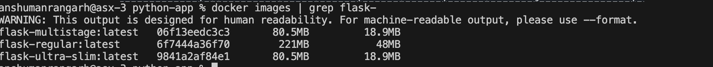
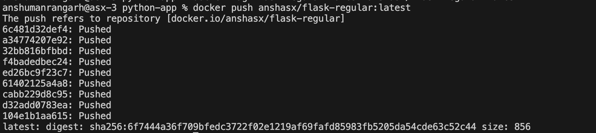
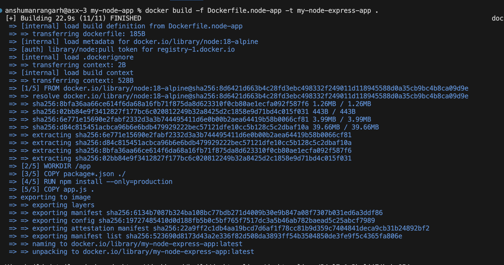
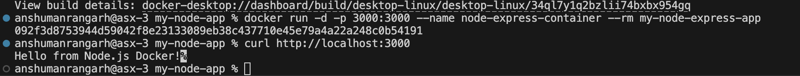

# **Experiment 4: Docker Essentials**
## `Dockerfile` `.dockerignore` `tagging` `publishing` 

## **Part 1: Containerizing Applications with Dockerfile**

### **Step 1: Create Python Flask App:**
```bash
mkdir python-app
cd python-app
```

**`app.py`:**
```python
from flask import Flask
app = Flask(__name__)

@app.route('/')
def hello():
    return "Hello from Docker!"

@app.route('/health')
def health():
    return "OK"

if __name__ == '__main__':
    app.run(host='0.0.0.0', port=5000)
```

**`requirements.txt`:**
```
blinker==1.9.0
click==8.3.1
Flask==3.1.3
itsdangerous==2.2.0
Jinja2==3.1.6
MarkupSafe==3.0.3
Werkzeug==3.1.6
```

### **Step 2: Create Dockerfile**

**`Dockerfile`:**
```dockerfile
FROM python:3.13-slim
WORKDIR /app
COPY requirements.txt .
RUN pip install --no-cache-dir -r requirements.txt
COPY app.py .
EXPOSE 5000
CMD ["python", "app.py"]
```

### **Step 3: Basic Build Command**

```bash
# Tag with version number
docker build -t my-flask-app:1.0 .

# Tag with multiple tags
docker build -t my-flask-app:latest -t my-flask-app:1.0 .

# Tag with custom registry
docker build -t username/my-flask-app:1.0 .

# Tag existing image
docker tag my-flask-app:latest my-flask-app:v1.0
```

### **Step 4: View Image Details**
```bash
# List all images
docker images

# Show image history
docker history my-flask-app

# Inspect image details
docker inspect my-flask-app
```

## **Part 2: Running Containers**

### **Step 1: Run Container**
```bash
# Run container with port mapping
docker run -d -p 5000:5000 --name flask-container my-flask-app

# Test the application
curl http://localhost:5000

# View running containers
docker ps

# View container logs
docker logs flask-container
```

### **Step 2: Manage Containers**
```bash
# Stop container
docker stop flask-container

# Start stopped container
docker start flask-container

# Remove container
docker rm flask-container

# Remove container forcefully
docker rm -f flask-container
```

## **Part 3: Multi-stage Builds**

### **Why Multi-stage Builds?**
- Smaller final image size
- Better security (remove build tools)
- Separate build and runtime environments

### **Step 1: Simple Multi-stage Dockerfile**

**`Dockerfile.multistage`:**
```dockerfile
FROM python:3.13-alpine AS builder
WORKDIR /app
COPY requirements.txt .
RUN pip install --no-cache-dir --user -r requirements.txt

FROM python:3.13-alpine
WORKDIR /app

COPY --from=builder /root/.local /root/.local
COPY app.py .

ENV PATH=/root/.local/bin:$PATH

RUN adduser -D appuser
USER appuser

EXPOSE 5001
CMD ["python", "app.py"]
```

### **Step 3: Build and Compare**
```bash
# Build regular image
docker build -t flask-regular .

# Build multi-stage image
docker build -f Dockerfile.multistage -t flask-multistage .

# Compare sizes
docker images | grep flask-
```



Saved **56.75%** in image size with multistage build.

## **Part 6: Publishing to Docker Hub**

### **Step 1: Prepare for Publishing**

```bash
# Login to Docker Hub
docker login

# Tag image for Docker Hub
docker tag flask-test:latest rajsatvik004/flask-test:latest

# Push to Docker Hub
docker push rajsatvik004/flask-test:latest
```



### **Step 2: Pull and Run from Docker Hub**
```bash
# Pull from Docker Hub (on another machine)
docker pull rajsatvik004/flask-test:latest

# Run the pulled image
docker run -d -p 5000:5000 rajsatvik004/flask-test:latest
```

## **Part 7: Node.js Example (Quick Version)**

### **Step 1: Node.js Application**
```bash
mkdir my-node-app
cd my-node-app
```

**`app.js`:**
```javascript
const express = require('express');
const app = express();
const port = 3000;

app.get('/', (req, res) => {
    res.send('Hello from Node.js Docker!');
});

app.get('/health', (req, res) => {
    res.json({ status: 'healthy' });
});

app.listen(port, () => {
    console.log(`Server running on port ${port}`);
});
```

**`package.json`:**
```json
{
  "name": "node-docker-app",
  "version": "1.0.0",
  "main": "app.js",
  "dependencies": {
    "express": "^4.18.2"
  }
}
```

### **Step 2: Node.js Dockerfile**
```dockerfile
FROM node:18-alpine
WORKDIR /app
COPY package*.json ./
RUN npm install --only=production
COPY app.js .
EXPOSE 3000
CMD ["node", "app.js"]
```

### **Step 3: Build and Run**
```bash
# Build image
docker build -t my-node-app .

# Run container
docker run -d -p 3000:3000 --name node-container my-node-app

# Test
curl http://localhost:3000
```



## **Essential Docker Commands Cheatsheet**

| Command         | Purpose                                                 | Example                                                     |
| --------------- | ------------------------------------------------------- | ----------------------------------------------------------- |
| `docker build`  | Build image                                             | `docker build -t myapp .`                                   |
| `docker run`    | Run container                                           | `docker run -p 3000:3000 myapp`                             |
| `docker ps`     | List containers                                         | `docker ps -a`                                              |
| `docker images` | List images                                             | `docker images`                                             |
| `docker tag`    | Tag image                                               | `docker tag myapp:latest myapp:v1`                          |
| `docker login`  | Login to Dockerhub using username and password or token | `echo "token" \| docker login -u username --password-stdin` |
| `docker push`   | Push to registry                                        | `docker push username/myapp`                                |
| `docker pull`   | Pull from registry                                      | `docker pull username/myapp`                                |
| `docker rm`     | Remove container                                        | `docker rm container-name`                                  |
| `docker rmi`    | Remove image                                            | `docker rmi image-name`                                     |
| `docker logs`   | View logs                                               | `docker logs container-name`                                |
| `docker exec`   | Execute command                                         | `docker exec -it container-name bash`                       |