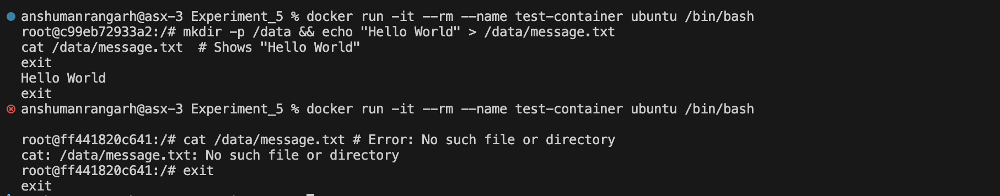
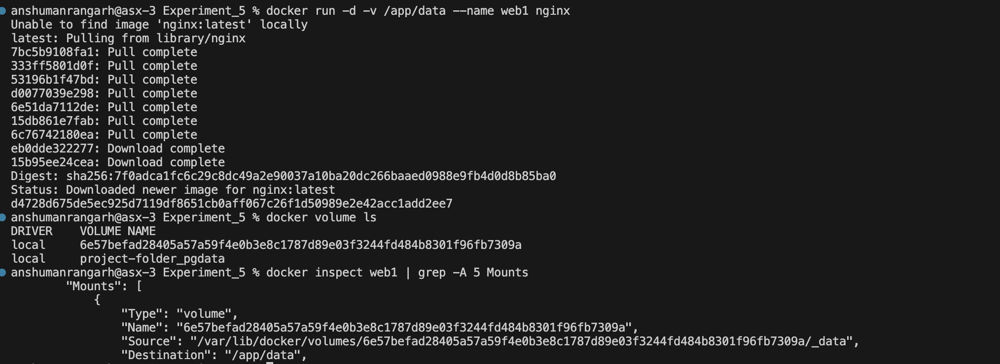
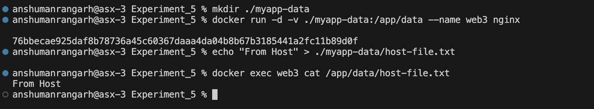

# **Experiment 5: Docker - Volumes, Environment Variables, Monitoring & Networks**

## **Part 1: Docker Volumes - Persistent Data Storage**

### **Lab 1: Understanding Data Persistence**

#### **The Problem: Container Data is Ephemeral**
```bash
docker run -it --name test-container ubuntu /bin/bash

mkdir -p /data && echo "Hello World" > /data/message.txt
cat /data/message.txt  # Shows "Hello World"
exit

docker start test-container
docker exec test-container cat /data/message.txt # Shows "Hello World"
```



Data isn't lost if the conatainer isn't removed.

```bash
docker run -it --rm --name test-container ubuntu /bin/bash

# In container
mkdir -p /data && echo "Hello World" > /data/message.txt
cat /data/message.txt  # Shows "Hello World"
exit

docker run -it --rm --name test-container ubuntu /bin/bash

# In container
cat /data/message.txt # Error: No such file or directory
exit
```



### **Lab 2: Volume Types**

#### **1. Anonymous Volumes**
```bash
docker run -d -v /app/data --name web1 nginx

# Check volume
docker volume ls
# Shows: anonymous volume with random hash

# Inspect container to see volume mount
docker inspect web1 | grep -A 5 Mounts
```


#### **2. Named Volumes**
```bash
# Create named volume
docker volume create mydata

# Use named volume
docker run -d -v mydata:/app/data --name web2 nginx

# List volumes
docker volume ls
# Shows: mydata

# Inspect volume
docker volume inspect mydata
```



#### **3. Bind Mounts (Host Directory)**
```bash
# Create directory on host
mkdir ./myapp-data

# Mount host directory to container
docker run -d -v ./myapp-data:/app/data --name web3 nginx

# Add file on host
echo "From Host" > ./myapp-data/host-file.txt

# Check in container
docker exec web3 cat /app/data/host-file.txt
# Shows: From Host
```


### **Lab 3: Volume Management Commands**
```bash
# List all volumes
docker volume ls

# Create a volume
docker volume create app-volume

# Inspect volume details
docker volume inspect app-volume

# Remove unused volumes
docker volume prune

# Remove specific volume
docker volume rm volume-name

# Copy files to/from volume
docker cp local-file.txt container-name:/path/in/volume
```